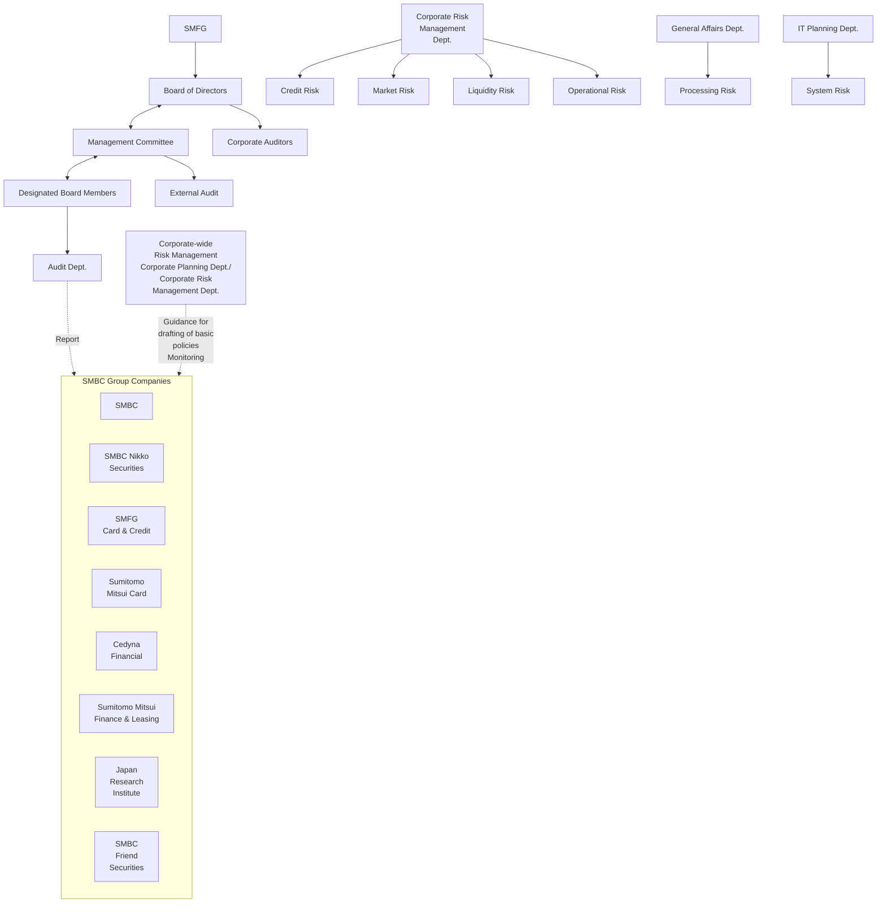
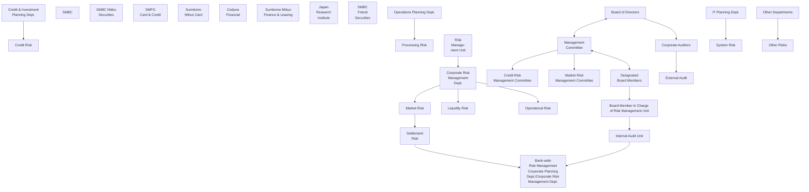

# Risk Management

[Logo: Two overlapping diamond shapes in dark green and light green]

## Basic Approach

As risks in the financial services increase in diversity and complexity, risk management—identifying, measuring, and controlling risk—has never been more important in the management of a financial holding company.

SMFG has encapsulated the basic principles to be employed in risk management in the manual entitled *Regulations on Risk Management*. In the manual, we have specified the basic policies for risk management: 1) Set forth SMFG's Groupwide basic policies for risk management after specifying the categories of risk to which these policies apply; 2) Provide all necessary guidance to Group companies to enable them to follow the basic risk management policies set forth by SMFG and set up their own appropriate risk management systems; and 3) Monitor the implementation of risk management by all Group companies to ensure that their practices meet the relevant standards.

## (1) Types of Risk to Be Managed

At SMFG, we classify risk into the following categories: (1) credit risk, (2) market risk, (3) liquidity risk and (4) operational risk (including processing risk and system risk). In addition, we provide individually tailored guidance to help Group companies identify categories of risk that need to be addressed. Risk categories are constantly reviewed, and new categories may be added in response to changes in the operating environment. The Corporate Risk Management Department works with the Corporate Planning Department to comprehensively and systematically manage all these categories of risk across the entire Group.

## (2) Fundamental Principles and Basic Policies for Risk Management

SMFG's Groupwide basic policies for risk management stipulate the fundamental principles for risk management that must be followed, and spell out risk management procedures from various perspectives. These include managing risk on a consolidated accounting basis, managing risk using quantification methods, ensuring consistency with business strategies, setting up a system of checks and balances, contingency planning for emergencies and serious situations, and verifying preparedness to handle all conceivable risk situations. In addition, there are specific operational policies for implementing appropriate management of risk by all Group companies.

Under SMFG's Groupwide basic policies for risk management, all Group companies periodically carry out reviews of the basic management policies for each risk category, or whenever deemed necessary, thus ensuring that the policies followed at any time are the most appropriate. The management of SMFG constantly monitors the conduct of risk management at Group companies, providing guidance when necessary.

## Risk Management System

Top management plays an active role in determining SMFG's Groupwide basic policies for risk management. The system works as follows: The basic policies for risk management are determined by the Management Committee before being authorized by the Board. The Management Committee, the designated board members, and the relevant risk management departments perform risk management according to the basic policies.

## ■SMFG's Risk Management System

32 SMFG 2011
