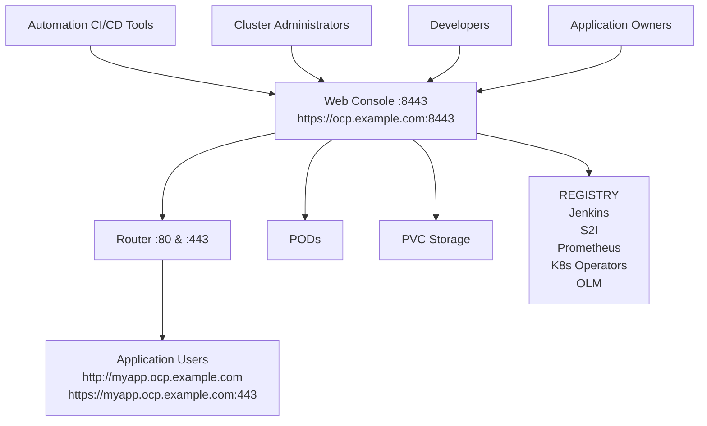
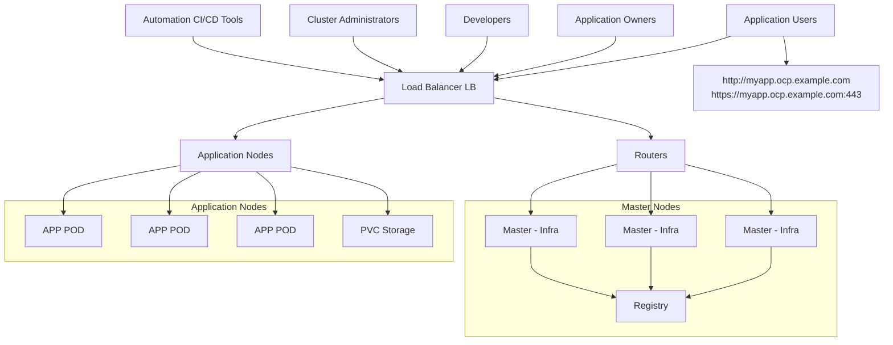

Draft Document for Review December 11, 2019 1:55 pm    8459ch06.fm

environment. The Master, Infrastructure and Compute Roles are deployed to a single node (Figure 6-1).

**Figure 6-1** OpenShift Container Platform 3.11 all-in-one

▶ **Seven nodes deployment** is highly available and suitable for production. The Master and Infrastructure Roles are deployed to three Nodes, the Computer Role is deployed to three Worker Nodes, and the Load Balancer is deployed to a single Node (Figure 6-2).

**Figure 6-2** OpenShift Container Platform 3.11 6xNodes + Load Balancer

Chapter 6. Installing Red Hat OpenShift 3.11 on IBM PowerVC   105
